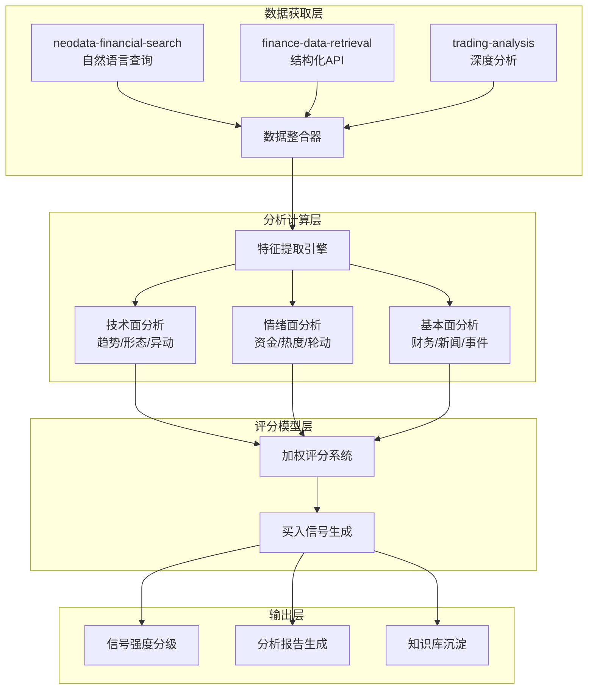

## 产品概述

构建一个识别买入信号的量化分析框架，整合多维度金融数据，建立综合评分模型，生成可执行的买入信号。

## 核心功能需求

### 1. 数据维度覆盖

- **基本面数据**：向上趋势识别、异常成交量检测、实时新闻监控
- **市场情绪指标**：资金流向、市场情绪度量、板块热度
- **板块轮动节奏**：板块间资金流动追踪、热点切换识别
- **技术分析形态**：K线形态识别、实盘异动检测、技术指标分析

### 2. 评分模型

- 多指标加权评分系统
- 买入信号生成逻辑
- 信号强度分级（强/中/弱）

### 3. 技术实现

- 数据源统一接入
- 实时与历史数据结合
- 自动化分析流程

## 技术栈选择

### 数据获取层

| 数据源 | 技术方案 | 覆盖数据 |
| --- | --- | --- |
| **NeoData金融搜索** | `neodata-financial-search` skill | 行情、财务、新闻、板块（第一优先级） |
| **结构化API** | `finance-data-retrieval` skill | 209个API接口（补充数据源） |
| **交易分析引擎** | `trading-analysis` skill | 多维度投资分析、买卖建议 |


### 分析计算层

- **Python + pandas**: 数据处理和指标计算
- **pandas_ta**: 技术指标计算（MA/MACD/RSI/布林带）
- **NumPy**: 数值计算和评分模型

### 架构设计



## 数据获取策略

### 核心数据维度映射

| 用户需求维度 | 对应API/Skill | 关键指标 |
| --- | --- | --- |
| **向上趋势** | `daily` + `index_daily` | 收盘价、MA均线、趋势斜率 |
| **异常成交量** | `daily` + `moneyflow` | 成交量突增、换手率异常 |
| **实时新闻** | `neodata-financial-search` + `news` | 新闻情感、事件驱动 |
| **市场情绪** | `moneyflow_ths` + `dc_hot` | 资金流向、热度排名 |
| **板块轮动** | `ths_daily` + `moneyflow_ind_ths` | 板块涨幅、资金流入 |
| **技术形态** | `limit_list_ths` + `stk_mins` | 涨停形态、分钟异动 |


### 数据获取优先级策略

```
第一优先: neodata-financial-search (自然语言实时查询)
    └── 覆盖: 行情、财报、板块、新闻、资金流向
    
第二优先: finance-data-retrieval (结构化API)
    └── 补充: 历史数据、批量数据、分钟级数据
    
第三优先: trading-analysis (深度分析)
    └── 生成: 买卖建议、风险评估、综合评分
```

## 评分模型设计

### 权重配置（可调整）

| 维度 | 权重 | 子指标 |
| --- | --- | --- |
| **技术面** | 40% | 趋势(15%) + 形态(15%) + 异动(10%) |
| **情绪面** | 35% | 资金流向(20%) + 市场情绪(15%) |
| **基本面** | 25% | 财务健康(15%) + 新闻事件(10%) |


### 评分算法

```python
综合评分 = Σ(维度得分 × 维度权重)

买入信号生成:
- 强信号: 综合评分 >= 80分
- 中信号: 60分 <= 综合评分 < 80分  
- 弱信号: 40分 <= 综合评分 < 60分
- 无信号: 综合评分 < 40分
```

### 信号确认机制

1. **多维度共振**: 至少2个维度评分>70分
2. **趋势确认**: 收盘价站上MA20且成交量放大
3. **风险控制**: 排除ST股票、近期有重大利空

## Agent扩展使用

### 核心技能

| 扩展名称 | 类型 | 用途 | 预期产出 |
| --- | --- | --- | --- |
| **neodata-financial-search** | Skill | 自然语言查询股票、板块、新闻、资金流向 | 实时金融数据 |
| **finance-data-retrieval** | Skill | 通过209个API获取结构化历史数据 | 日线/分钟线/财务数据 |
| **trading-analysis** | Skill | 多维度投资分析，生成BUY/SELL/HOLD建议 | 投资分析报告 |
| **A股量化 AkShare** | Skill | A股量化数据分析，获取板块和行情 | 板块成分股、技术指标 |


### 子Agent规划

基于trading-analysis框架，创建专业分析Agent:

- **market-analyst**: 技术面分析（趋势、形态、异动）
- **sentiment-analyst**: 情绪面分析（资金、热度、轮动）
- **fundamentals-analyst**: 基本面分析（财务、新闻）
- **risk-manager**: 风险评估和仓位建议